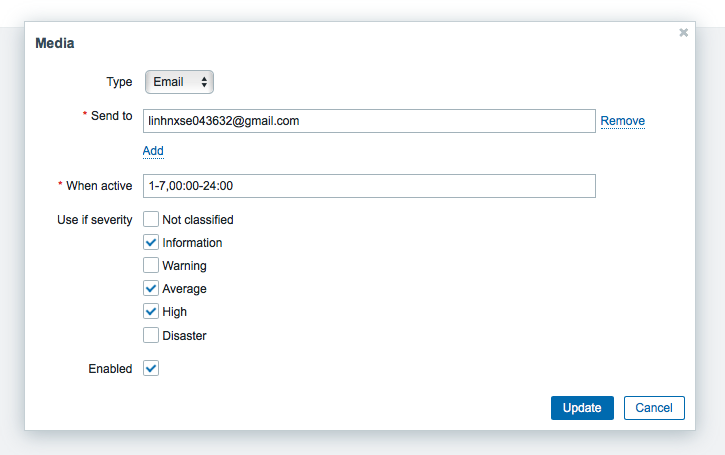

# Zabbix Notification Email

### Bước 1:
Truy cập vào mục **Administration/Media**, sau đó click vào Email settings như hình dưới:

Sau đó điền các trường thông tin như sau:
 - Name: Email
 - Type: Email
 - SMTP server: smtp.google.com
 - SMTP server port: 25
 - SMTP helo: gmail.com
 - SMTP email: (mail của người gửi)
 - Connection security: Chọn STTARTTLS
 - Authentication: Chọn Username and password
   
Điền đủ thông tin các trường Username và password rồi ấn Update

### Bước 2:
Truy cập vào mục **Administration/Users**, nhấn vào tab Admin rồi trình duyệt sẽ hiển thị ra ba trường thông tin bao gồm User, Media, Permissions. Ở trường User, chúng ta để mặc định và chuyển sang trường Media, ấn vào Edit và chọn các mức độ mà bạn muốn bắn email cảnh báo như hình sau:

Trong đó, send to là địa chỉ mail nhận cảnh báo, when active là khoảng thời gian hoạt động và format là: **d-d,hh:mm-hh:mm**, với d-d là day to day, với 1 đến 7 tương ứng từ monday tơi sunday, 00:00-24:00 là khoảng thời gian nguyên 1 ngày

### Bước 3:
Truy cập vào thư mục **Configuration/Actions**, sau đó click vào **Report problems Zabbix administrator**. Ở đây chúng ta thấy có 3 tab bao gồm Action, Operations và Recovery operations. Để ý rằng ở trường thông tin New condition chúng ta chọn Trigger và select các mức độ bạn muốn cảnh báo, bạn có thể chọn group cũng như là host tương ứng muốn nhận cảnh báo khi xảy ra issues rồi tiến hành update.
Tiếp theo sang tab Operations chúng ta chọn edit và chỉnh sửa các trường sau rồi tiến hành update:
 - Send to Users chúng ta chọn Admin (Zabbix Administrator)
 - Trường Send only to chúng ta chọn Email

Thực hiện tương tự với tab recovery operations

Các bước cấu hình email notify hoàn thành, việc bây giờ là thực hiện restart agent rồi đợi mail bắn cảnh báo trả về là hoàn hành

