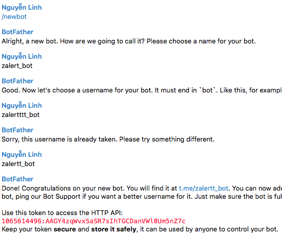
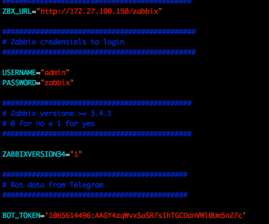
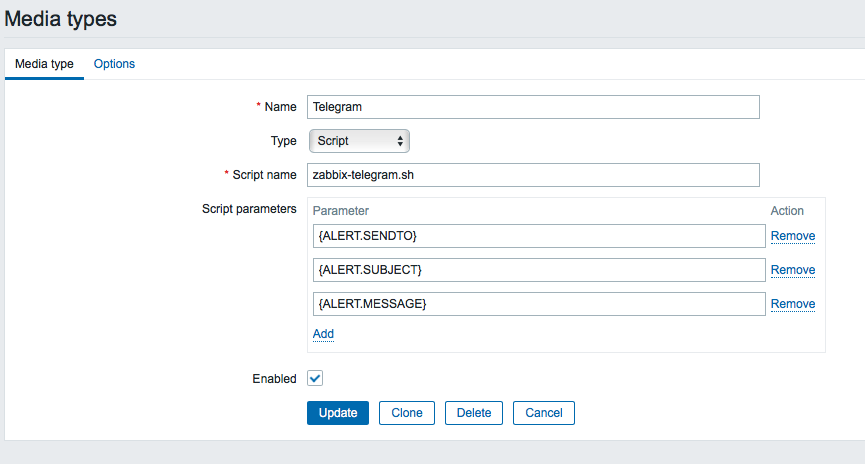
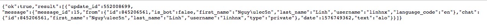
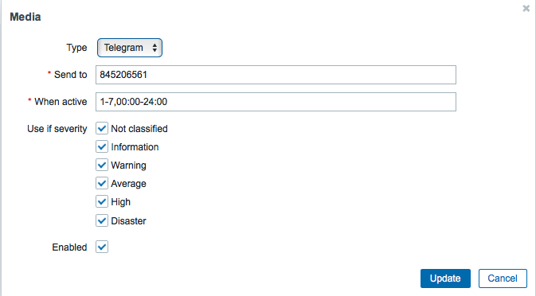
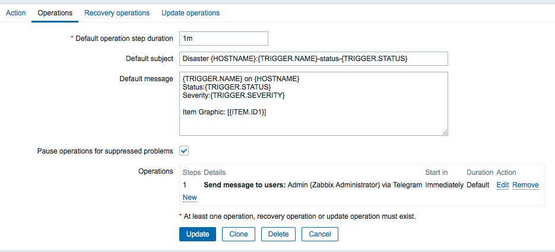
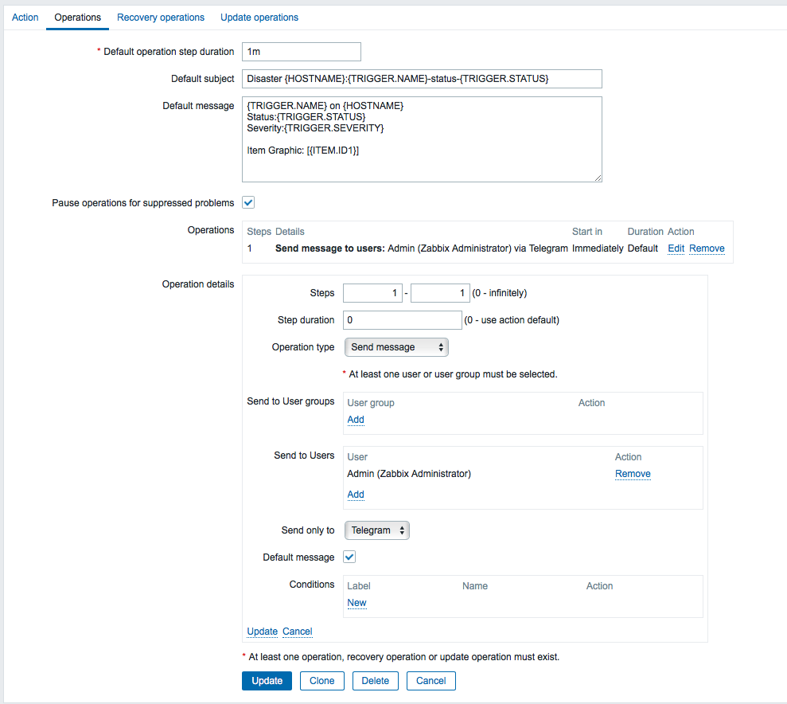
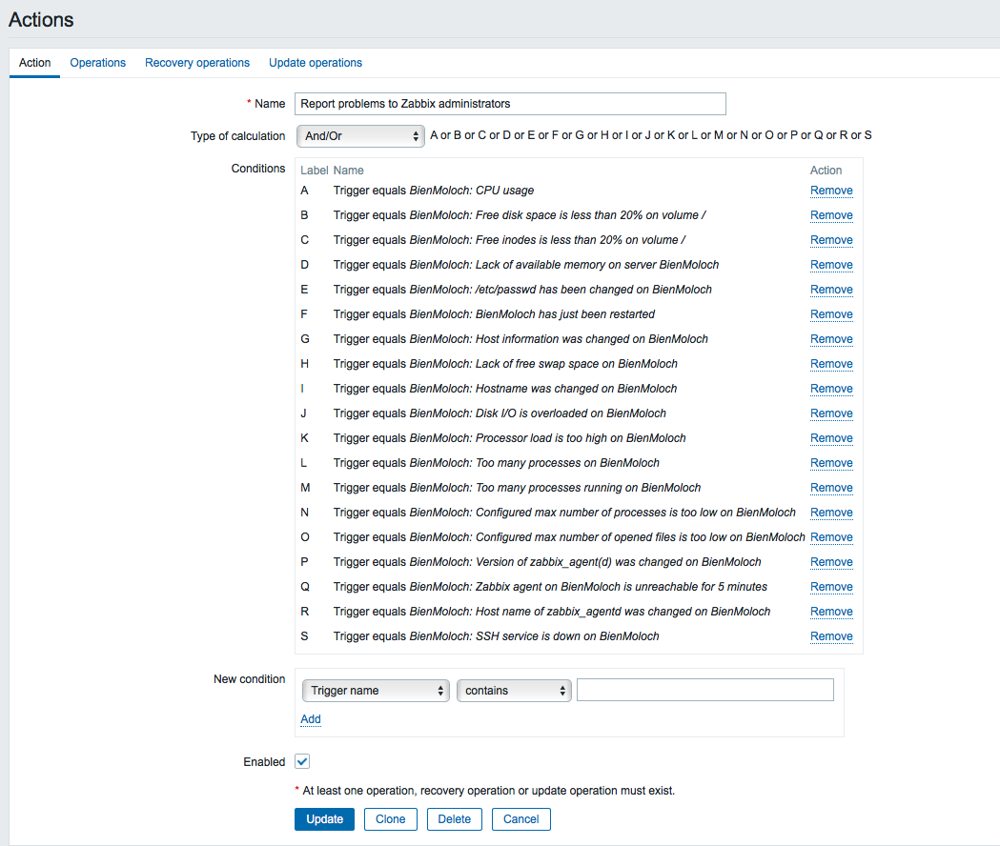
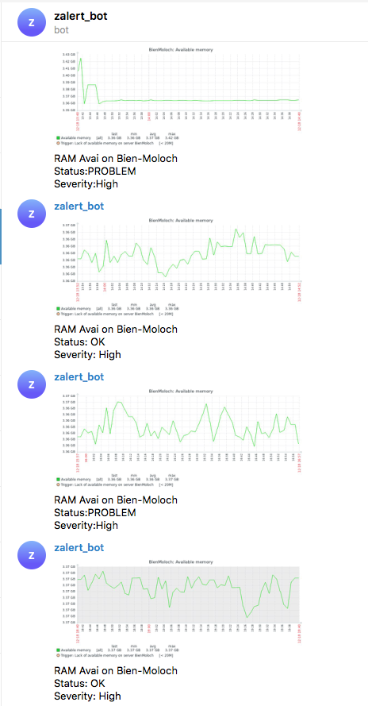

# Zabbix Telegram Alert(Thiêt lập cảnh báo qua telegram)

Zabbix hỗ trợ cảnh báo qua nhiều kênh khác nhau, điều này giúp quản trị viên chủ động nhận được các thông tin để tiến hành quản lý cũng như chủ động khắc phục hoặc phòng chống các sự cố có thể xảy ra, ngoài email là một kênh phổ biến thì telegram cũng là một kênh được sự dụng ngày càng rộng rãi do tính dễ sử dụng, dùng được cả trên app mobile

### Bước 1: (Tạo bot telegram)
Truy cập vào link: HTTPS://telegram.me/BotFather để tiến hành tạo bot cho riêng mình. Các bước được tiến hành theo các bước như sau:

- /newbot để tiến hành tạo bot
- namebot để tiến hành đặt tên cho bot (chữ thường kết thúc bằng chữ bot)
- usernamebot để đặt tên username cho bot

Sau khi tạo xong, chúng ta sẽ được như hình sau:


Ở đây, bot đã được tạo thành công và telegram sẽ trả lại thông tin của bot bao gồm: Kênh telegram vừa được tạo và một chuỗi token, và chúng ta sẽ dùng chuỗi token này để khai báo trong script gửi cảnh báo ở các bước tiếp theo

### Bước 2: (Cấu hình alert scripts telegram)
1. Download scripts alert telegram
   
Vào thư mục để chứa scripts và download script về:
```bash
cd /usr/lib/zabbix/alertscripts
wget https://raw.githubusercontent.com/domanhduy/zabbix-monitor/master/Alert/TelegramV1/zabbix-telegram.sh
chmod +x zabbix-telegram.sh
```
2. Chỉnh sửa file scripts

Tiến hành sửa tham số ZBX_URL bằng địa chỉ của zabbix-server, cùng với đó bao gồm USERNAME, PASSWORD, BOT_TOKEN được tạo ra ở bước trên:



3. Cấu hình cảnh báo telegram trên Web Zabbix
- Truy cập vào Zabbix server
- Tạo media type
  
Media type là kênh để zabbix server gửi cảnh báo, có thể là Email, SMS hay một kênh được tạo ra bằng scripts.
```
Click Administrator -> Media types -> Create media type
```
Nhập các thông tin về meida type mới cần tạo
```
Name: Telegram (Tên có thể tuỳ đặt)
Type: Script
Script name: Tên của script có trong thư mục alert script của server zabbix
Script parameter:
{ALERT.SENDTO}
{ALERT.SUBJECT}
{ALERT.MESSAGE}
```

Click vào add để có thêm một Media type mới có tên là Telegram

- Set user nhận alert qua Telegram
  
Lấy CHAT ID telegram của người dùng
Đầu tiên chúng ta chat 1 cái gì đó ở kênh mình vừa tạo ra rồi truy cập vào link sau: https://api.telegram.org/bot${TOKEN}/getUpdates
Với ${TOKEN} chính là chuỗi token API mà khi tạo bot telegram trả về ở bước trên

Với id ở đây chính là 845206561
Sau khi có chatid chúng ta thiết lập nhận alerrt qua telegram
```
Click Administrator -> User -> Lựa chọn user nhận cảnh báo ở đây tôi chọn Admin
Click tab Media -> Add
Thiết lập telegram nhận cảnh báo với:

Type: là Telegram
Sendto: 845206561 (Chat id chúng ta get được ở bước trên)
Use of serverity: các mức cảnh báo: tích vào các mức cảnh báo chúng ta cần
When active: 1-7,00:00-24:00 (từ thứ 2 đến chủ nhật, và bắn cảnh báo 24h/ngày)
Enable: tích chọn
Click Update
```


- Tạo action
Action ở đây sẽ phục vụ việc bắn cảnh báo khi có các thông số bất thường
```
Click Configuration -> Action -> Create action
Tại tab Action tiến hành nhập thông tin:
Name: Tên action muốn tạo
Tại tab operation, ta sửa một số trường thông tin sau:

Default operation step duration:
  1m
Default subject (Tiêu đề của thông báo):
  Disaster {HOSTNAME}:{TRIGGER.NAME}-status-{TRIGGER.STATUS}
Default message (Nội dung của thông báo):
  {TRIGGER.NAME} on {HOSTNAME}
  Status:{TRIGGER.STATUS}
  Severity:{TRIGGER.SEVERITY}

  Item Graphic: [{ITEM.ID1}]
```

Click new và thiết lập user được nhận cảnh báo là admin

Click add
```
Tab Recovery operation (Thiết lập thông tin về bản tin cảnh báo gửi đi khi vấn đề được giải quyết, dưới ngưỡng cảnh báo):

Default subject (Tiêu đề của thông báo recovery):
  OK Resolved: {HOSTNAME}:{TRIGGER.NAME}-status-{TRIGGER.STATUS}
Default message (Nội dung của thông báo):
  {TRIGGER.NAME} on {HOSTNAME}
  Status: {TRIGGER.STATUS}
  Severity: {TRIGGER.SEVERITY}
  Values: {ITEM.VALUE1}

  Item Graphic: [{ITEM.ID1}]
```
Sau khi nhập đủ thông tin click Add, vậy là đã tạo thành công Action mới

- Test cảnh báo qua telegram
Ở tab action chúng ta tiến hành add các action muốn bắn cảnh báo, ở đây tôi add hết vào trong đó có action là bắn cảnh báo khi restart

sau đó tiến hành vào máy agent rồi tiến hành restart máy và kết quả nhận được là:

